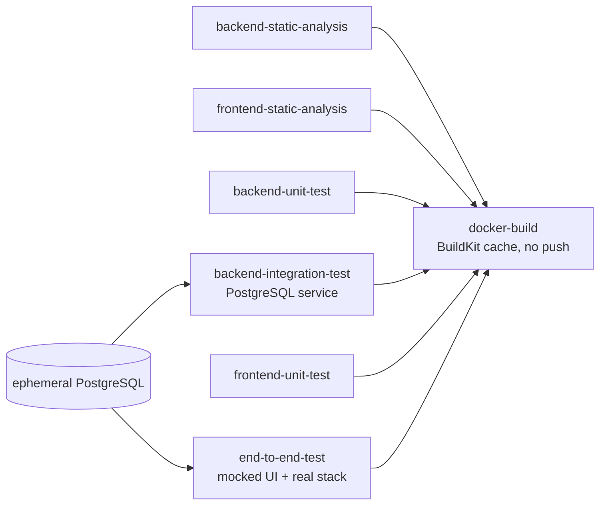
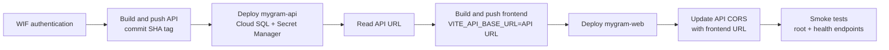

# MyGram - Social Media Backend API

MyGram is a Go/Gin social media backend for users, photos, comments, and social media links. This repository is being prepared for a fullstack app with:

- Backend: Go, Gin, GORM, PostgreSQL
- Frontend: React, Vite, TypeScript, Tailwind
- Deployment: Docker Compose on Coolify, with GHCR images and Jenkins pipeline support

See [TASK.md](TASK.md) for the phased implementation handoff and [DEPLOYMENT.md](DEPLOYMENT.md) for the Coolify/Jenkins deployment plan.

## Continuous Integration

GitHub Actions runs [`.github/workflows/ci.yml`](.github/workflows/ci.yml) for every pull request and push. The workflow has read-only repository permissions, uses ephemeral test-only configuration, and never connects to Cloud SQL or pushes container images.



| Assessment requirement | GitHub Actions job | Evidence produced |
| --- | --- | --- |
| Backend static analysis | `backend-static-analysis` | `gofmt` check, `go vet ./...`, and golangci-lint |
| Frontend static analysis | `frontend-static-analysis` | clean `npm ci`, TypeScript typecheck, and ESLint |
| Backend unit test | `backend-unit-test` | database-independent tests with the race detector and uploaded coverage profile |
| Backend integration test | `backend-integration-test` | API/controller tests against an ephemeral PostgreSQL 15 service; CI fails if the database cannot be reached |
| Frontend unit test | `frontend-unit-test` | Vitest suite after a clean `npm ci` |
| End-to-end test | `end-to-end-test` | Playwright Chromium suites plus reports uploaded on failure |
| Backend and frontend container build | `docker-build` | both Dockerfiles built with BuildKit GitHub Actions cache after all quality/test jobs pass; images are not pushed |

The Playwright coverage intentionally has two layers:

- `npm run test:e2e:mocked` runs the broad UI suite with Playwright route mocks. It validates browser navigation, forms, authorization UI, responsive viewports, and PWA behavior without depending on external services.
- `npm run test:e2e:real` is a real-stack smoke test. It uses the actual React/Vite frontend, Go API, and an ephemeral PostgreSQL service to register, log in, verify readiness, and load the authenticated feed. It does not use Garage, Cloud SQL, GCP, or any production endpoint.

The `docker-build` job has explicit dependencies on every analysis and test job. Pull requests and pushes only build local CI images with `push: false`; deployment is outside this workflow.

## Continuous Deployment to Cloud Run

The [Cloud Run CD workflow](.github/workflows/cd.yml) runs only for pushes to `main` and manual `workflow_dispatch` runs. It authenticates through Workload Identity Federation with service-account impersonation; no service-account key is stored in GitHub.

Deployment order:



Repository-level GitHub Actions variables required before deployment:

| Variable | Purpose |
| --- | --- |
| `GARAGE_S3_ENDPOINT` | Garage S3-compatible endpoint |
| `GARAGE_S3_REGION` | Garage region passed to the AWS SDK |
| `GARAGE_S3_BUCKET` | Garage bucket used for MyGram media |

Required GCP resources and IAM bindings must already exist:

- Enable the Cloud Run, Artifact Registry, Cloud SQL Admin, Secret Manager, IAM Credentials, and Security Token Service APIs.
- Create the `mygram-containers` Docker repository, Cloud SQL instance/database/user, four Secret Manager secrets, and both service accounts named in the workflow.
- Allow the GitHub repository identity in the Workload Identity Provider to impersonate `github-mygram-deployer` with `roles/iam.workloadIdentityUser`.
- Grant the deployment service account permission to write Artifact Registry images, administer Cloud Run services, and act as `mygram-runtime`.
- Grant `mygram-runtime` `roles/cloudsql.client` and access to the four named secrets. No service-account JSON key is required or accepted by this workflow.

The workflow references these Google Secret Manager secrets directly from Cloud Run without reading their values in GitHub Actions:

- `mygram-db-password` → `DB_PASSWORD`
- `mygram-jwt-secret` → `JWT_SECRET`
- `mygram-s3-access-key` → `S3_ACCESS_KEY_ID`
- `mygram-s3-secret-key` → `S3_SECRET_ACCESS_KEY`

The database configuration was audited for Cloud Run. GORM's PostgreSQL DSN accepts a Unix socket path, so the API uses `DB_HOST=/cloudsql/mygram-suitmedia-figo-2026:asia-southeast2:mygram-postgres`, `DB_PORT=5432`, and `DB_SSLMODE=disable`. Cloud Run's Cloud SQL integration provides the authenticated and encrypted local proxy connection; the application never connects to a production public database address.

The frontend Nginx upstream is runtime-configurable through `API_UPSTREAM`. It defaults to `http://api:8080` for Docker Compose, while CD sets it to the deployed Cloud Run API URL. The Vite bundle also receives that URL through `VITE_API_BASE_URL`, so both direct API calls and the existing same-origin proxy routes remain valid.

Both images use the full Git commit SHA as the Artifact Registry tag. The same `gcloud run deploy` commands create the services on their first run and update them on later runs. Concurrent production deployments share one concurrency group, so a newer commit cancels an older in-progress deployment. Deployment fails if the frontend root or any API health endpoint is unavailable.

Rollback procedures are documented in [docs/ROLLBACK.md](docs/ROLLBACK.md). Redis is not part of this deployment, and media storage remains Garage S3 rather than Google Cloud Storage.

## Current Backend Features

- User registration and login
- Password hashing with bcrypt
- JWT authentication with 24 hour token expiration
- RBAC with `user` and `admin` roles
- Optional Cap captcha verification for registration/login
- Admin dashboard API for stats, user listing, user updates, ban/unban, and delete
- Photo CRUD with ownership authorization
- Authenticated image upload to S3-compatible object storage for photo media
- Same-origin media proxy at `/media/uploads/photos/*` for uploaded images
- Comment CRUD with ownership authorization
- Social media link CRUD with ownership authorization
- Health, liveness, and readiness endpoints
- Public OpenAPI spec at `/openapi/public.json`
- Swagger UI at `/swagger/index.html`, configurable as `internal`, `public`, or `disabled`
- CORS middleware for frontend integration
- Env-driven database, JWT, CORS, and port configuration

## API Endpoints

Legacy endpoints are still available:

```text
POST   /users/register
POST   /users/login

POST   /photos/create
GET    /photos/getall
GET    /photos/get/:photoId
PUT    /photos/update/:photoId
DELETE /photos/delete/:photoId

POST   /comments/create/:photoId
GET    /comments/getall
GET    /comments/getall/:photoId
GET    /comments/get/:commentId
PUT    /comments/update/:commentId
DELETE /comments/delete/:commentId

POST   /socialmedia/create
GET    /socialmedia/getall
GET    /socialmedia/get/:socialMediaId
PUT    /socialmedia/update/:socialMediaId
DELETE /socialmedia/delete/:socialMediaId
```

Cleaner aliases are also available under `/api/v1`:

```text
POST   /api/v1/auth/register
POST   /api/v1/auth/login
GET    /api/v1/me
PATCH  /api/v1/me

POST   /api/v1/photos
GET    /api/v1/photos
GET    /api/v1/photos/:photoId
PUT    /api/v1/photos/:photoId
DELETE /api/v1/photos/:photoId

POST   /api/v1/uploads/photos
GET    /media/uploads/photos/*

GET    /api/v1/comments
GET    /api/v1/comments/:commentId
PUT    /api/v1/comments/:commentId
DELETE /api/v1/comments/:commentId

GET    /api/v1/photos/:photoId/comments
POST   /api/v1/photos/:photoId/comments

POST   /api/v1/social-media
GET    /api/v1/social-media
GET    /api/v1/social-media/:socialMediaId
PUT    /api/v1/social-media/:socialMediaId
DELETE /api/v1/social-media/:socialMediaId

GET    /api/v1/admin/stats
GET    /api/v1/admin/users
GET    /api/v1/admin/users/:userId
PATCH  /api/v1/admin/users/:userId
DELETE /api/v1/admin/users/:userId
POST   /api/v1/admin/users/:userId/ban
POST   /api/v1/admin/users/:userId/unban
```

Protected routes require:

```text
Authorization: Bearer <jwt>
```

## Environment

Copy `.env.example` to `.env` for local development.

Required backend variables:

```bash
PORT=8080
GIN_MODE=debug
JWT_SECRET=replace-with-a-random-32-plus-character-secret
JWT_EXPIRATION_HOURS=24
CORS_ALLOWED_ORIGINS=http://localhost:3000,http://localhost:5173
PUBLIC_OPENAPI_ENABLED=true
SWAGGER_UI_MODE=internal

CAP_ENABLED=false
CAP_BASE_URL=https://cap.fgdev.tech
CAP_SITE_KEY=replace-with-cap-site-key
CAP_SECRET_KEY=replace-with-cap-secret-key
CAP_REQUIRED_ON_LOGIN=true

S3_ENDPOINT=https://s3.fgdev.tech
S3_REGION=garage
S3_BUCKET=fgdev-media
S3_ACCESS_KEY_ID=replace-with-garage-access-key
S3_SECRET_ACCESS_KEY=replace-with-garage-secret-key
S3_FORCE_PATH_STYLE=true
# Prefer this in production so images load through the MyGram domain.
S3_PUBLIC_BASE_URL=https://mygram.example.com/media
S3_UPLOAD_MAX_MB=4

DB_HOST=localhost
DB_USER=postgres
DB_PASSWORD=admin
DB_NAME=finalproject
DB_PORT=5432
DB_SSLMODE=disable
```

## Local Development Without Docker

```bash
go mod download
go test ./...
go run main.go
```

The backend starts on `http://localhost:8080` by default.

In another terminal:

```bash
cd mygram-frontend
npm ci
npm run dev
```

The frontend dev server starts on `http://localhost:3000` by default. Use Laragon/PostgreSQL locally and keep your local `.env` out of git.

## Optional Local Fullstack Docker

Local Docker is optional. The preferred Docker verification path is GitHub Actions and Jenkins before Coolify deployment.

```bash
docker compose -f docker-compose.fullstack.yml --env-file .env up --build
```

The active production compose file is `docker-compose.prod.yml`. Older Redis/test compose files were removed so there is only one optional local fullstack compose and one Coolify production compose.

Expected local URLs:

- Frontend: `http://localhost:3000`
- API: `http://localhost:8080`
- Public OpenAPI: `http://localhost:8080/openapi/public.json`
- Swagger: `http://localhost:8080/swagger/index.html`

`SWAGGER_UI_MODE=internal` shows the full developer Swagger UI. `SWAGGER_UI_MODE=public` shows only public user-facing endpoints. `SWAGGER_UI_MODE=disabled` removes the Swagger UI route while keeping `/openapi/public.json` if `PUBLIC_OPENAPI_ENABLED=true`.

## Test Database

The API tests expect a PostgreSQL database named `finalproject_test` using the env values from `main_test.go`. If the database is unavailable, DB-backed tests skip instead of touching the development database.
