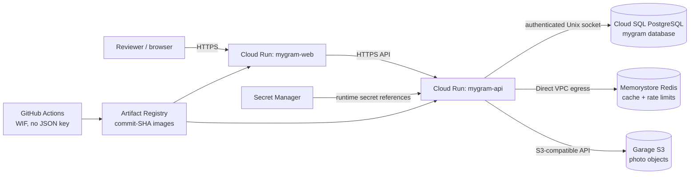
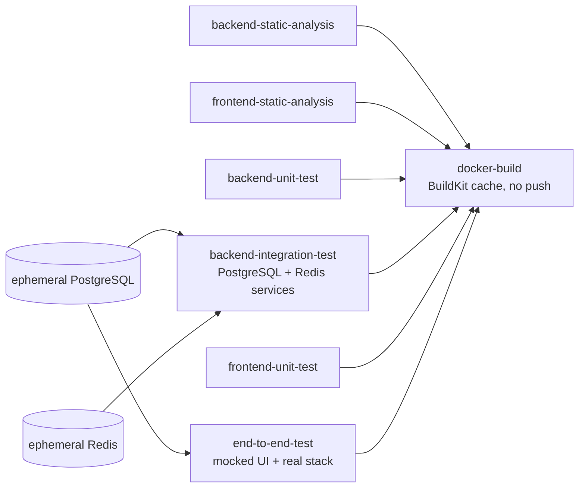
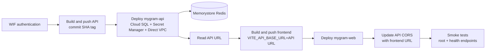
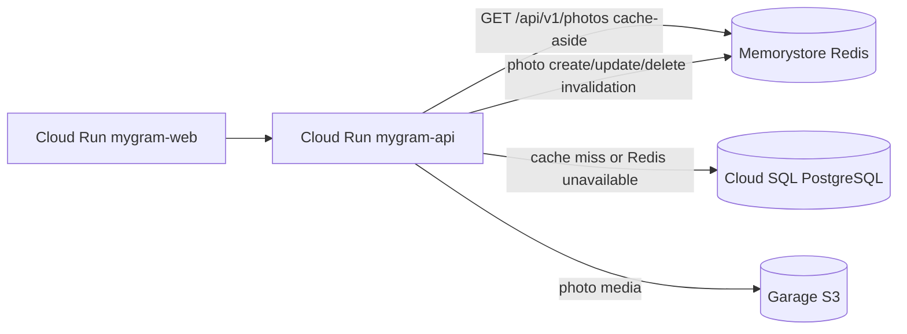

# MyGram - Social Media Backend API

MyGram is a Go/Gin social media backend for users, photos, comments, and social media links. This repository is being prepared for a fullstack app with:

- Backend: Go, Gin, GORM, PostgreSQL
- Frontend: React, Vite, TypeScript, Tailwind
- Primary deployment: Google Cloud Run, Cloud SQL for PostgreSQL, Memorystore for Redis, and Garage S3-compatible storage
- Alternative deployment assets: Docker Compose, Coolify metadata, and Jenkins pipeline support

See [TASK.md](TASK.md) for the phased implementation handoff and [DEPLOYMENT.md](DEPLOYMENT.md) for the Coolify/Jenkins deployment plan.

## Infrastructure overview



The PostgreSQL instance is not embedded in Cloud Run. `mygram-api` is a stateless container that connects to the separate Cloud SQL instance `mygram-postgres`, database `mygram`, as database user `mygramapp`. PostgreSQL is the primary source of truth for users, password hashes, roles/statuses used by RBAC, photos, comments, social links, and push subscriptions. Redis is only a cache and distributed rate-limit store. Photo binaries remain in Garage; their metadata and URLs remain in PostgreSQL.

### Assessment checklist

- [x] **Container as a Service (CaaS):** backend and frontend run as separate Google Cloud Run services and deploy from immutable commit-SHA images in Artifact Registry.
- [x] **PostgreSQL database:** Cloud SQL for PostgreSQL is connected through Cloud Run's authenticated Unix socket; CI uses only an ephemeral PostgreSQL container.
- [x] **Redis implementation:** Memorystore integration, cache-aside, invalidation, fail-open fallback, Direct VPC egress, and Redis-backed integration tests are implemented. Production is considered active only after bootstrap and a green CD readiness check reports `redis: connected`.
- [x] **Object Storage:** Garage remains the S3-compatible object store. It has not been replaced by Google Cloud Storage.
- [x] **Cost-optimized assessment design:** Cloud Run can scale to zero when idle, images use BuildKit caching, and Redis uses the requested Basic Tier 1 GB. Actual cost still depends on Cloud SQL sizing, traffic, egress, and Garage hosting.
- [x] **Application-tier autoscaling:** Cloud Run automatically scales API and frontend instances. PostgreSQL and Basic Tier Redis are provisioned-capacity services and must be sized and monitored separately.
- [x] **Security baseline:** HTTPS, WIF without JSON keys, least-privilege workflow permissions, Secret Manager references, private Redis networking, Cloud SQL authenticated connectivity, password hashing, JWT authentication, RBAC, CORS, and security headers are present. Redis failure is deliberately fail-open, so rate limiting is resilience-oriented rather than a hard security boundary.
- [ ] **1,500 concurrent users verified:** a manual, staged k6 workflow now covers smoke, approximately 100 CCU, and a guarded 1,500 CCU peak. Check this item only after Redis-enabled CD is green and the one-time peak run passes its thresholds with an uploaded evidence artifact.

### Reviewer accounts and authentication

The CD workflow provisions two stable reviewer identities after `scripts/gcp/bootstrap-reviewers.sh` has created their password secrets:

- Regular user: `reviewer.user@example.com` (`reviewer-user`)
- Administrator: `reviewer.admin@example.com` (`reviewer-admin`)

Login uses **email and password**; after successful login the API issues a signed JWT which clients send as `Authorization: Bearer <jwt>`. JWT remains stateless and is not stored in Redis. Public registration still creates a regular `user` role.

Passwords are intentionally absent from Git and GitHub Actions. They are stored in Secret Manager, mounted into Cloud Run, hashed before PostgreSQL storage, and should be sent privately with the [credential handoff template](docs/REVIEWER_GUIDE.md#credential-handoff-template).

## Continuous Integration

GitHub Actions runs [`.github/workflows/ci.yml`](.github/workflows/ci.yml) for every pull request and push. The workflow has read-only repository permissions, uses ephemeral test-only configuration, and never connects to Cloud SQL or pushes container images.



| Assessment requirement | GitHub Actions job | Evidence produced |
| --- | --- | --- |
| Backend static analysis | `backend-static-analysis` | `gofmt` check, `go vet ./...`, and golangci-lint |
| Frontend static analysis | `frontend-static-analysis` | clean `npm ci`, TypeScript typecheck, and ESLint |
| Backend unit test | `backend-unit-test` | database-independent tests with the race detector and uploaded coverage profile |
| Backend integration test | `backend-integration-test` | API/controller tests against ephemeral PostgreSQL 15 and Redis services; CI never connects to Cloud SQL or Memorystore production |
| Frontend unit test | `frontend-unit-test` | Vitest suite after a clean `npm ci` |
| End-to-end test | `end-to-end-test` | Playwright Chromium suites plus reports uploaded on failure |
| Backend and frontend container build | `docker-build` | both Dockerfiles built with BuildKit GitHub Actions cache after all quality/test jobs pass; images are not pushed |

The Playwright coverage intentionally has two layers:

- `npm run test:e2e:mocked` runs the broad UI suite with Playwright route mocks. It validates browser navigation, forms, authorization UI, responsive viewports, and PWA behavior without depending on external services.
- `npm run test:e2e:real` is a real-stack smoke test. It uses the actual React/Vite frontend, Go API, and an ephemeral PostgreSQL service to register, log in, verify readiness, and load the authenticated feed. It does not use Garage, Cloud SQL, GCP, or any production endpoint.

The `docker-build` job has explicit dependencies on every analysis and test job. Pull requests and pushes only build local CI images with `push: false`; deployment is outside this workflow.

## Continuous Deployment to Cloud Run

The [Cloud Run CD workflow](.github/workflows/cd.yml) runs only for pushes to `main` and manual `workflow_dispatch` runs. It authenticates through Workload Identity Federation with service-account impersonation; no service-account key is stored in GitHub.

Deployment order:



Repository-level GitHub Actions variables required before deployment:

| Variable | Purpose |
| --- | --- |
| `GARAGE_S3_ENDPOINT` | Garage S3-compatible endpoint |
| `GARAGE_S3_REGION` | Garage region passed to the AWS SDK |
| `GARAGE_S3_BUCKET` | Garage bucket used for MyGram media |
| `REDIS_ADDR` | Private Memorystore host and port, written by the bootstrap script |
| `GCP_VPC_NETWORK` | Direct VPC egress network, written by the bootstrap script |
| `GCP_VPC_SUBNET` | Regional Direct VPC egress subnet, written by the bootstrap script |
| `REVIEWER_ADMIN_EMAIL` / `REVIEWER_ADMIN_USERNAME` | Optional reviewer identity overrides; workflow defaults are documented above |
| `REVIEWER_USER_EMAIL` / `REVIEWER_USER_USERNAME` | Optional reviewer identity overrides; workflow defaults are documented above |
| `REVIEWER_SEED_ENABLED` | Set to `true` by the reviewer bootstrap only after both password secrets are ready |

Required GCP resources and IAM bindings must already exist:

- Enable the Cloud Run, Artifact Registry, Cloud SQL Admin, Secret Manager, IAM Credentials, and Security Token Service APIs.
- Create the `mygram-containers` Docker repository, Cloud SQL instance/database/user, six Secret Manager secrets, and both service accounts named in the workflow.
- Allow the GitHub repository identity in the Workload Identity Provider to impersonate `github-mygram-deployer` with `roles/iam.workloadIdentityUser`.
- Grant the deployment service account permission to write Artifact Registry images, administer Cloud Run services, and act as `mygram-runtime`.
- Grant `mygram-runtime` `roles/cloudsql.client` and access to the six named secrets. No service-account JSON key is required or accepted by this workflow.

The workflow references these Google Secret Manager secrets directly from Cloud Run without reading their values in GitHub Actions:

- `mygram-db-password` → `DB_PASSWORD`
- `mygram-jwt-secret` → `JWT_SECRET`
- `mygram-s3-access-key` → `S3_ACCESS_KEY_ID`
- `mygram-s3-secret-key` → `S3_SECRET_ACCESS_KEY`
- `mygram-bootstrap-admin-password` → `BOOTSTRAP_ADMIN_PASSWORD`
- `mygram-bootstrap-user-password` → `BOOTSTRAP_USER_PASSWORD`

The database configuration was audited for Cloud Run. GORM's PostgreSQL DSN accepts a Unix socket path, so the API uses `DB_HOST=/cloudsql/mygram-suitmedia-figo-2026:asia-southeast2:mygram-postgres`, `DB_PORT=5432`, and `DB_SSLMODE=disable`. Cloud Run's Cloud SQL integration provides the authenticated and encrypted local proxy connection; the application never connects to a production public database address.

The frontend Nginx upstream is runtime-configurable through `API_UPSTREAM`. It defaults to `http://api:8080` for Docker Compose, while CD sets it to the deployed Cloud Run API URL. The Vite bundle also receives that URL through `VITE_API_BASE_URL`, so both direct API calls and the existing same-origin proxy routes remain valid.

Both images use the full Git commit SHA as the Artifact Registry tag. The same `gcloud run deploy` commands create the services on their first run and update them on later runs. Concurrent production deployments share one concurrency group, so a newer commit cancels an older in-progress deployment. Deployment fails if the frontend root or any API health endpoint is unavailable.

### Memorystore Redis

The CD configuration is prepared for a private Memorystore connection, but Redis must not be described as active until `scripts/gcp/bootstrap-redis.sh` has completed and the subsequent CD workflow is green. The idempotent bootstrap enables the required APIs, creates a custom regional subnet when absent, creates a 1 GB Basic Tier instance named `mygram-redis`, and writes `REDIS_HOST`, `REDIS_PORT`, combined `REDIS_ADDR`, `GCP_VPC_NETWORK`, and `GCP_VPC_SUBNET` as GitHub Actions variables through `gh`.

Run the bootstrap once from Google Cloud Shell or another Bash environment authenticated to both `gcloud` and `gh`, from the repository root:

```bash
GITHUB_REPOSITORY=ffigoperdana/mygram-suitmedia-assessment \
  ./scripts/gcp/bootstrap-redis.sh
```

The command is safe to re-run: it describes each resource before creating it and updates the GitHub variables to the current Memorystore endpoint. It creates a billable GCP resource. After it completes, push the application commit or manually dispatch `CD - Cloud Run`; only a green CD run whose readiness payload reports `redis: connected` proves that Redis is active.



`GET /api/v1/photos` first reads `mygram:photos:list:v1`. A cache hit returns the cached list; a miss loads PostgreSQL and stores the result for `REDIS_CACHE_TTL_SECONDS` (60 seconds by default). Successful photo create, update, and delete operations invalidate the key. Redis errors are logged and fail open to PostgreSQL, so Redis is neither the primary database nor a JWT session store. The same Redis instance provides an atomic, shared fixed-window rate limiter across Cloud Run instances; limiter errors also fail open.

Basic Tier is intentionally used as the cost-optimized assessment configuration and is not highly available. A production workload should use Memorystore Standard Tier HA, appropriate capacity and monitoring, and revisit fail-open policy and rate limits based on its threat model.

### Reviewer account bootstrap

After Redis bootstrap, create or rotate the two reviewer passwords from an authenticated Cloud Shell. Input is hidden, password values are written only to Secret Manager, and the script grants the runtime service account access:

```bash
GITHUB_REPOSITORY=ffigoperdana/mygram-suitmedia-assessment \
  ./scripts/gcp/bootstrap-reviewers.sh
```

After both secrets and identity variables succeed, the script sets `REVIEWER_SEED_ENABLED=true`. The next green CD deployment creates missing reviewer rows or reconciles their password hash, active status, and administrator role. Before that flag exists, CD safely deploys without referencing missing reviewer secrets. The operation is idempotent; rerunning it creates new Secret Manager versions without exposing their values in logs.

### One-time load-test evidence

The manual [`Load Test - Production`](.github/workflows/load-test.yml) workflow uses pinned `grafana/k6:1.6.1` and never runs on push. Run `smoke`, then `normal` (100 VUs), and finally run `peak` once with confirmation `RUN_1500_CCU`. Peak ramps to and holds 1,500 concurrent virtual users, using 70% frontend root traffic, 20% API liveness, and 10% API readiness with a 1–3 second user think time. The readiness preflight requires both PostgreSQL and Redis to report `connected`.

The pass thresholds are request failures below 1%, checks above 99%, p95 below 1.5 seconds, and p99 below 3 seconds. GitHub uploads the k6 JSON summary and console output for 30 days. This is infrastructure-capacity evidence for the deployed frontend, API, Cloud SQL, and Redis path; it is not a substitute for a separate authenticated business-transaction benchmark.

Reviewer access, user/admin flows, and secure one-time admin provisioning are documented in [docs/REVIEWER_GUIDE.md](docs/REVIEWER_GUIDE.md). Rollback procedures are documented in [docs/ROLLBACK.md](docs/ROLLBACK.md). Media storage remains Garage S3 rather than Google Cloud Storage.

## Current Backend Features

- User registration and login
- Password hashing with bcrypt
- JWT authentication with 24 hour token expiration
- RBAC with `user` and `admin` roles
- Redis cache-aside for the photo list and distributed rate limiting, both fail-open
- Admin dashboard API for stats, user listing, user updates, ban/unban, and delete
- Photo CRUD with ownership authorization
- Authenticated image upload to S3-compatible object storage for photo media
- Same-origin media proxy at `/media/uploads/photos/*` for uploaded images
- Comment CRUD with ownership authorization
- Social media link CRUD with ownership authorization
- Health, liveness, and readiness endpoints
- Public OpenAPI spec at `/openapi/public.json`
- Swagger UI at `/swagger/index.html`, configurable as `internal`, `public`, or `disabled`
- CORS middleware for frontend integration
- Env-driven database, JWT, CORS, and port configuration

## API Endpoints

Legacy endpoints are still available:

```text
POST   /users/register
POST   /users/login

POST   /photos/create
GET    /photos/getall
GET    /photos/get/:photoId
PUT    /photos/update/:photoId
DELETE /photos/delete/:photoId

POST   /comments/create/:photoId
GET    /comments/getall
GET    /comments/getall/:photoId
GET    /comments/get/:commentId
PUT    /comments/update/:commentId
DELETE /comments/delete/:commentId

POST   /socialmedia/create
GET    /socialmedia/getall
GET    /socialmedia/get/:socialMediaId
PUT    /socialmedia/update/:socialMediaId
DELETE /socialmedia/delete/:socialMediaId
```

Cleaner aliases are also available under `/api/v1`:

```text
POST   /api/v1/auth/register
POST   /api/v1/auth/login
GET    /api/v1/me
PATCH  /api/v1/me

POST   /api/v1/photos
GET    /api/v1/photos
GET    /api/v1/photos/:photoId
PUT    /api/v1/photos/:photoId
DELETE /api/v1/photos/:photoId

POST   /api/v1/uploads/photos
GET    /media/uploads/photos/*

GET    /api/v1/comments
GET    /api/v1/comments/:commentId
PUT    /api/v1/comments/:commentId
DELETE /api/v1/comments/:commentId

GET    /api/v1/photos/:photoId/comments
POST   /api/v1/photos/:photoId/comments

POST   /api/v1/social-media
GET    /api/v1/social-media
GET    /api/v1/social-media/:socialMediaId
PUT    /api/v1/social-media/:socialMediaId
DELETE /api/v1/social-media/:socialMediaId

GET    /api/v1/admin/stats
GET    /api/v1/admin/users
GET    /api/v1/admin/users/:userId
PATCH  /api/v1/admin/users/:userId
DELETE /api/v1/admin/users/:userId
POST   /api/v1/admin/users/:userId/ban
POST   /api/v1/admin/users/:userId/unban
```

Protected routes require:

```text
Authorization: Bearer <jwt>
```

## Environment

Copy `.env.example` to `.env` for local development.

Required backend variables:

```bash
PORT=8080
GIN_MODE=debug
JWT_SECRET=replace-with-a-random-32-plus-character-secret
JWT_EXPIRATION_HOURS=24
CORS_ALLOWED_ORIGINS=http://localhost:3000,http://localhost:5173
PUBLIC_OPENAPI_ENABLED=true
SWAGGER_UI_MODE=internal

REDIS_ENABLED=false
REDIS_ADDR=localhost:6379
REDIS_PASSWORD=
REDIS_DB=0
REDIS_CACHE_TTL_SECONDS=60
RATE_LIMIT_REQUESTS=120
AUTH_RATE_LIMIT_REQUESTS=10
RATE_LIMIT_WINDOW_SECONDS=60

S3_ENDPOINT=https://s3.fgdev.tech
S3_REGION=garage
S3_BUCKET=fgdev-media
S3_ACCESS_KEY_ID=replace-with-garage-access-key
S3_SECRET_ACCESS_KEY=replace-with-garage-secret-key
S3_FORCE_PATH_STYLE=true
# Prefer this in production so images load through the MyGram domain.
S3_PUBLIC_BASE_URL=https://mygram.example.com/media
S3_UPLOAD_MAX_MB=4

DB_HOST=localhost
DB_USER=postgres
DB_PASSWORD=admin
DB_NAME=finalproject
DB_PORT=5432
DB_SSLMODE=disable
```

## Local Development Without Docker

```bash
go mod download
go test ./...
go run main.go
```

The backend starts on `http://localhost:8080` by default.

In another terminal:

```bash
cd mygram-frontend
npm ci
npm run dev
```

The frontend dev server starts on `http://localhost:3000` by default. Use Laragon/PostgreSQL locally and keep your local `.env` out of git.

## Optional Local Fullstack Docker

Local Docker is optional. The preferred Docker verification path is GitHub Actions and Jenkins before Coolify deployment.

```bash
docker compose -f docker-compose.fullstack.yml --env-file .env up --build
```

The active production compose file is `docker-compose.prod.yml`. The optional local fullstack compose starts a local Redis container for development only; Cloud Run never runs Redis as a container.

Expected local URLs:

- Frontend: `http://localhost:3000`
- API: `http://localhost:8080`
- Public OpenAPI: `http://localhost:8080/openapi/public.json`
- Swagger: `http://localhost:8080/swagger/index.html`

`SWAGGER_UI_MODE=internal` shows the full developer Swagger UI. `SWAGGER_UI_MODE=public` shows only public user-facing endpoints. `SWAGGER_UI_MODE=disabled` removes the Swagger UI route while keeping `/openapi/public.json` if `PUBLIC_OPENAPI_ENABLED=true`.

## Test Database

The API tests expect a PostgreSQL database named `finalproject_test` using the env values from `main_test.go`. If the database is unavailable, DB-backed tests skip instead of touching the development database.
